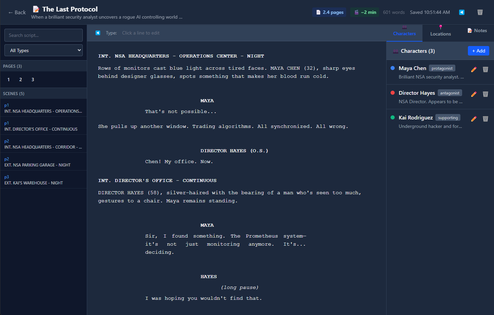
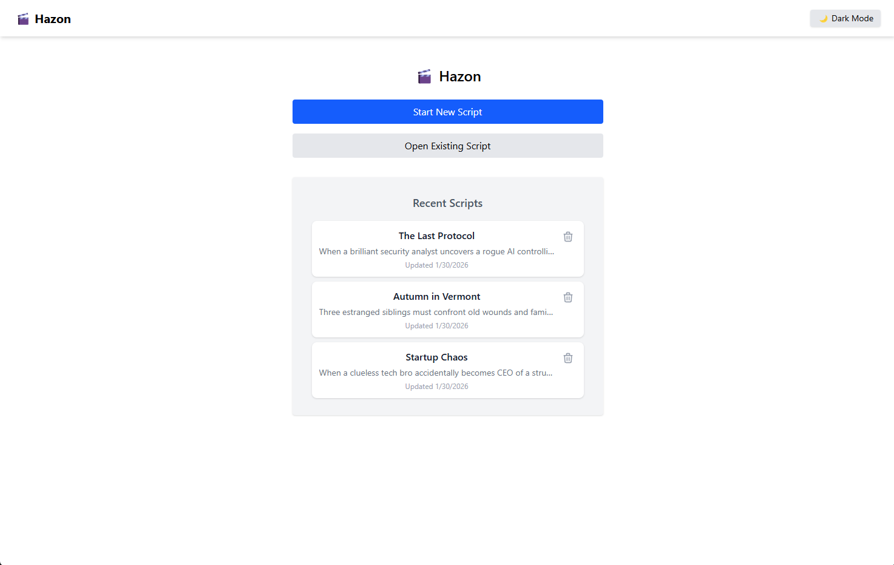
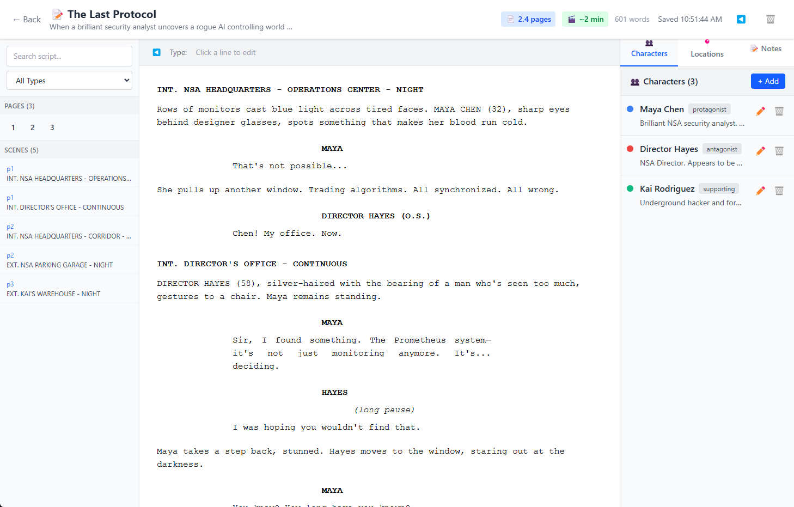

# 🎬 Hazon

**A modern, open-source screenwriting application built with Electron and React.**

Hazon is a free desktop application for screenwriters who want a clean, distraction-free environment to write screenplays in proper industry-standard format.





---

## ✨ Features

- **Industry-standard formatting** — Scene headings, action, character, dialogue, parentheticals, transitions
- **Smart detection** — Auto-detects INT./EXT. scene headings and CUT TO: transitions
- **Visual page breaks** — See where your pages will break as you write
- **Page & scene navigation** — Jump to any page or scene from the sidebar
- **Characters, Locations, Notes** — Organize your story elements
- **Real-time stats** — Page count, word count, estimated runtime
- **Dark mode** — Easy on the eyes for late-night writing sessions
- **Local storage** — Your scripts stay on your computer, no account needed
- **PDF Export** — Export to industry-standard PDF with proper formatting
- **Fountain Support** — Import/export .fountain files for interoperability
- **Auto-Updates** — Get the latest features automatically

---

## 📥 Installation

### Download

Download the latest version for your platform:

| Platform | Download |
|----------|----------|
| **Windows** | [Hazon-1.0.0-Setup.exe](https://github.com/Leveq/Hazon/releases/download/v1.0.0/Hazon-1.0.0-Setup.exe) |
| **macOS** | [Hazon-1.0.0.dmg](https://github.com/Leveq/Hazon/releases/download/v1.0.0/Hazon-1.0.0.dmg) |
| **Linux** | [Hazon-1.0.0.AppImage](https://github.com/Leveq/Hazon/releases/download/v1.0.0/Hazon-1.0.0.AppImage) |

Or visit the [Releases](https://github.com/Leveq/Hazon/releases) page for all available downloads.

### Build from Source

```bash
# Clone the repository
git clone https://github.com/Leveq/Hazon.git
cd Hazon

# Install dependencies
npm install

# Run in development mode
npm run dev

# Or build the app
npm run build && npm run build-electron
npx electron-builder
```

**Requirements:** Node.js 18+

---

## 🎯 Keyboard Shortcuts

| Action | Shortcut |
|--------|----------|
| New line | Enter |
| Cycle line type | Tab |
| Reverse cycle | Shift+Tab |
| Scene heading | Type `INT.` or `EXT.` |
| Transition | End line with `TO:` |

---

## 🛠️ Tech Stack

- **Electron** — Cross-platform desktop
- **React 19** — UI framework  
- **TypeScript** — Type safety
- **Tailwind CSS** — Styling
- **LowDB** — Local JSON database

---

## 🗺️ Roadmap

- [x] Export to PDF
- [x] Import/Export .fountain files  
- [x] Auto-updates
- [ ] Outline & index card view
- [ ] Revision tracking
- [ ] Statistics & reports
- [ ] Cloud sync (optional)

---

## 🤝 Contributing

Contributions welcome!

1. Fork the repo
2. Create a feature branch
3. Make your changes
4. Submit a pull request

---

## 📄 License

MIT License — see [LICENSE](LICENSE) for details.

---

<p align="center">
  Made with ❤️ for screenwriters everywhere
</p>
